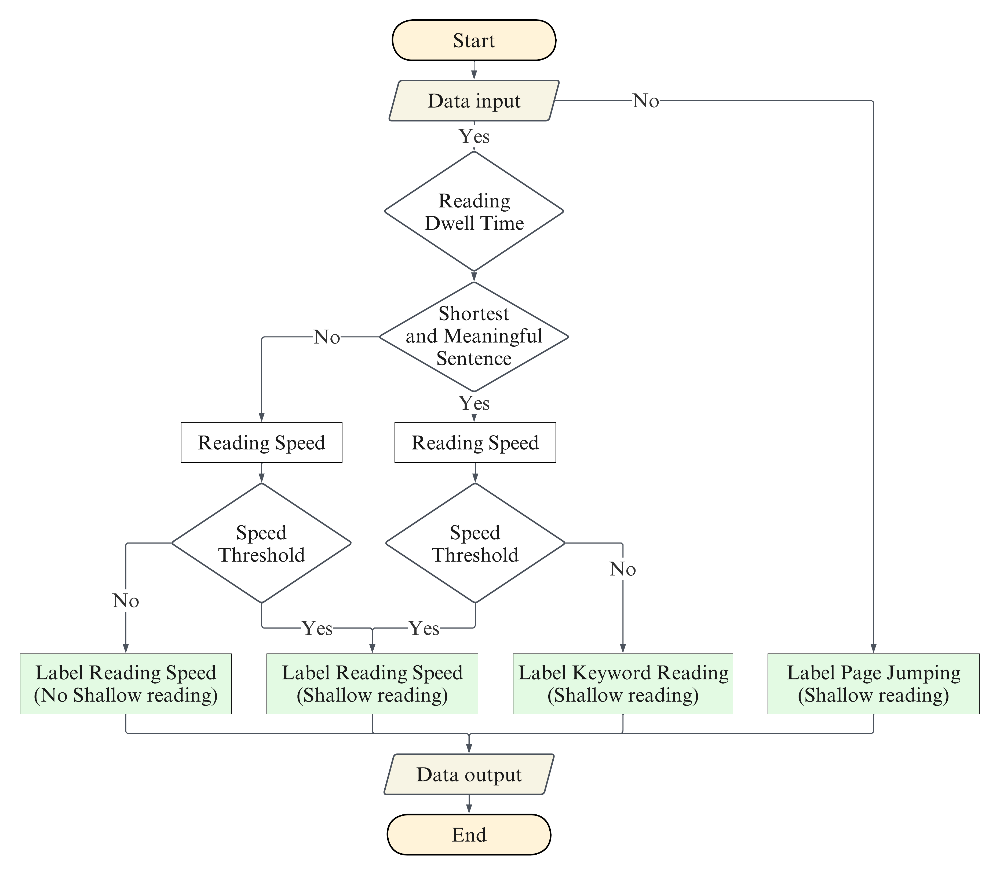

# Introduction

The proliferation of online learning platforms has revolutionized education, providing learners with unprecedented access to educational resources. However, this shift towards digital learning environments has also raised concerns about the quality of learning experiences, particularly regarding reading behaviors. Shallow reading, characterized by rapid scanning, short dwell times, and fragmented keyword-focused reading, has emerged as a prevalent behavior in online learning settings. Understanding and addressing shallow reading behaviors is crucial for optimizing learning outcomes and improving the efficacy of online education.

# Significance of Developing Shallow Reading Recognition Programs

The exponential growth of information accessible online has accompanied the widespread adoption of internet-connected devices and the proliferation of online learning environments (Yin & Hwang, 2018). However, this expansion in online learning has brought forth several challenges, particularly due to shifts in learners' behavioral patterns (Rose, 2010; Coiro, 2014; Simamora, 2020; Aikins & Easter, 2018).

One of the significant behavioral shifts in online learning is the preference for shallow reading, which has become a core trend (Carr, 2011). Shallow reading, characterized by a surface-level engagement with text, is associated with reduced comprehension and difficulty in extracting key information (Miller et al., 2014; Shapiro & Waters, 2005).

Despite its prevalence, defining shallow reading in terms of its behavioral features remains a challenge. The complexity arises from the varied correlations between shallow reading behaviors and factors such as dwell time, reading speed, and keyword scanning (McLean, 2019). Moreover, the accuracy of identifying shallow reading behaviors depends on the precision of their definitions, leading to representational biases in behavioral modeling (Maldonado Mahauard et al., 2018).

Existing studies on shallow reading have relied on conceptual descriptions and literature reviews due to the absence of a clear definition (Carr, 2011). However, this lack of clarity hinders accurate assessment and understanding of its impact on learning outcomes.

To address this issue, it is imperative to establish clear definitions of shallow reading and its behavioral features, especially in the context of large-scale online learning environments with vast amounts of behavioral data (Locher & Philipp, 2023). Extracting measurable data based on accurate definitions is essential, as suggested by Martin and Pearl (2019), who proposed three behavioral features: duration, rate, and intensity. A quantitative behavioral model is crucial for effectively assessing shallow reading behaviors and their implications for learning performance and engagement (Leshner & Pfaff, 2011).

In conclusion, developing accurate and effective models for recognizing shallow reading behaviors is essential for understanding their prevalence, impact, and implications for online learning environments. Without precise definitions and robust models, it remains challenging to assess the relationship between shallow reading behaviors and learning outcomes comprehensively (Khalil et al., 2022).

## Formula and Recognition Process

### Shallow Reading Recognition Formula

According to previous research, reading speed (frequency: how fast), reading dwell time (duration: how long), and keyword reading (quantity: how much) are three fundamental dimensions of reading behavior. These are three basic indicators of shallow reading behavior, with measurable and observable reading data.

- **Reading Speed Value (RSV)**: The most prospective response to reading state. We will use a threshold of 400 words per minute (Liang & Huang, 2014) to determine which reading speed falls within the range indicative of shallow reading behavior.
  
  The formula is represented as:

  \[ RSV = \frac{N}{T} \]

  Where:
  - \( RSV \) refers to the reading speed value,
  - \( N \) is the number of words read, and
  - \( T \) is the time spent on reading.

- **Reading Dwell Time (RDT)**: Measuring the Duration of Reading Staying (DRS). In shallow reading, DRS is characterized by which learners jump pages. We will consider a minimum Duration of Reading Staying (DRS) of 8 seconds (McSpadden, 2015) as the threshold for effective learning. If the DRS is less than 8 seconds, it suggests should reading behavior.

  The formula for identifying Page Jumping (PJ) behavior is:

  \[ d \in PJ \quad \text{if} \quad d \leq DRS \]

  Where:
  - \( PJ \) refers to a student's page jump behavior, and
  - \( d \) reports the DRS of one page jump behavior, which is less than or equal to the DRS threshold.

- **Keyword Reading (KWR) Threshold**: The Keyword Reading (KWR) threshold is an unfixed value that requires statistical analysis of the content of the textbooks used by the survey respondents. The specific method involves calculating the length of all sentences in the textbook, including titles of chapters, subheadings, figure captions, table titles, and other explanatory text. To determine the KWR threshold, follow these steps: 1. Calculate Sentence Length: Measure the length of each sentence in the textbook. Consider a complete sentence as one that ends with a period (.), indicating a full stop, or a half sentence ending with a comma (,). 2. Identify Shortest Sentence: Identify the shortest sentence in the textbook, which includes both complete and half sentences. 3. Use Shortest Sentence as Threshold: Use the length of the shortest sentence as the KWR threshold. This threshold represents the minimum number of words considered significant enough to indicate engaged reading behavior. By establishing the KWR threshold using this method, we can effectively gauge the depth of engagement with the text and identify instances of shallow reading behavior.

### Identifying Shallow Reading Behavior

The judgment process for identifying shallow reading behaviors involves the following steps:

1. **Determine DRS Threshold**: Identify which DRS is below the specified threshold for shallow reading behavior. If no PJ behavior is identified, proceed to the next step.
   
2. **Identify KWR**: Determine if the corresponding senses are the shortest and most meaningful. If the senses are not the shortest and most meaningful and the reading speed is above the set threshold, characterize the reading behavior as shallow.

3. **Characterize Reading Behavior**: Based on the above criteria, classify reading behavior as either shallow or not shallow.

# Conclusion

In conclusion, the development of a shallow reading behavior recognition program is essential for understanding and addressing the challenges posed by changes in online learning behavior. By accurately identifying and analyzing shallow reading behaviors, educators and researchers can improve online learning experiences and outcomes, ultimately enhancing the effectiveness of online education.

# References
- Carr, N. (2011) *The shadows: What the Internet is doing to our brains.* W. W. Norton.

- Coiro, J. (2014) *Online reading comprehension: Challenges and opportunities.* Texto Livre, 7(2), 30-43. [DOI](https://doi.org/10.17851/1983-3652.7.2.30-43)

- Khalil, M., Prinsloo, P., & Slade, S. (2022, March) A comparison of learning analytics frameworks: A systematic review. In *LAK22: 12th International Learning Analytics and Knowledge Conference* (pp. 152-163).

- Liang, T. H., & Huang, Y. M. (2014) An investment of reading rate patterns and retention outcomes of elementary school students with e-books. *Journal of Educational Technology & Society*, 17(1), 218-230.

- Martin, G., & Pearl, J. J. (2019) *Behavior modification: What it is and how to do it* (11th Edition). Routledge. [Link](https://www.routledge.com/9780815366546)

- McLean, C. A. (2019) The shadows? The nature and properties of digital/screen reading. *The Reading Teacher*, 73(4), 535-542. [DOI](https://doi.org/10.1002/trtr.18)

- Maldonado Mahauad, J., Pérez Sanagustín, M., Kizilc, R. F., Morales, N., & Munoz Gama, J. (2018) Mining theory based patterns from big data: Identifying self-regulated learning strategies in Massive Open Online Courses. *Computers in Human Behavior*, 80, 179-196. [DOI](https://doi.org/10.1016/j.chb.2017.11.011)

- Miller, P., Kargin, T., & Guldenoglu, B. (2014) Differences in the reading of shallow and deep orthography: Developmental evidence from Hebrew and Turkish readers. *Journal of Research in Reading*, 37, 409-432. [DOI](https://doi.org/10.1111/j.1467-9817.2012.01540.x)

- Rose, E. (2010) Continuous partial attention: Reconsidering the role of online learning in the age of interruption. *Educational Technology*, 50(4), 41-46.

- Shapiro, A. M., & Waters, D. L. (2005) An investigation of the cognitive processes underlying the keyword method of foreign vocabulary learning. *Language Teaching Research*, 9(2), 129-146. [DOI](https://doi.org/10.1191/1362168805lr151oa)

- Simamora, R. M. (2020) The Challenges of online learning during the COVID-19 pandemic: An essay analysis of performing arts education students. *Studies in Learning and Teaching*, 1(2), 86-103. [DOI](https://doi.org/10.46627/silet.v1i2.38)

- Yin, C., & Hwang, G. J. (2018) Roles and Strategies of Learning Analytics in the e-Publication Era. *Knowledge Management & E-Learning*, 10(4), 455-468. [DOI](https://doi.org/10.34105/j.kmel.2018.10.028)

